<h1>Kelompok 11 MI2022B</h1>
<h2> Tugas 2 API</h2>
<h2>Dokumentasi Open API</h2>

Anggota Kelompok:

Ilma Nur Hidayah (22091397064)

Haniza Kurnia Dwi Putri (22091397070)

Yohana Monalisa (2205102087)

 
<ol type = "a">
  <Strong><Li>Source Code</Li></Strong>
  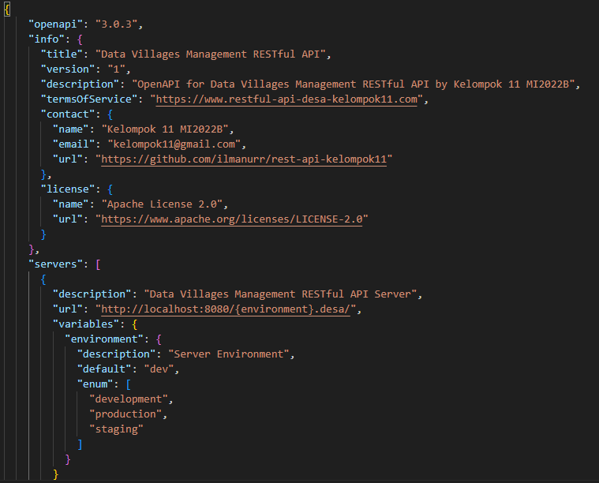
  
  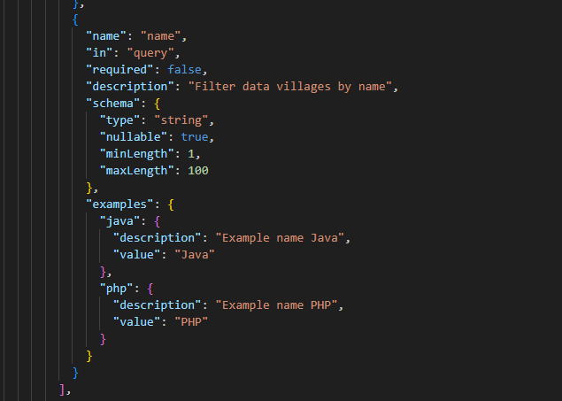
  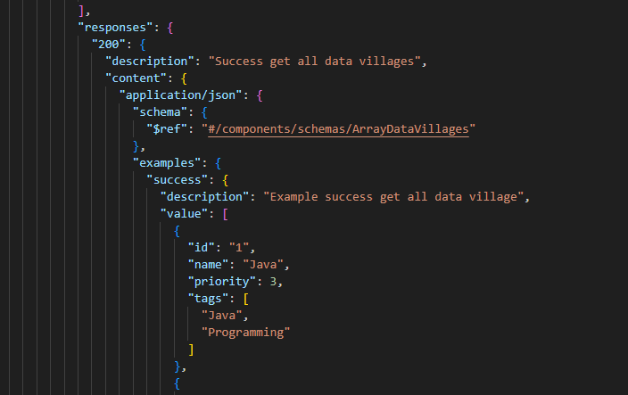
  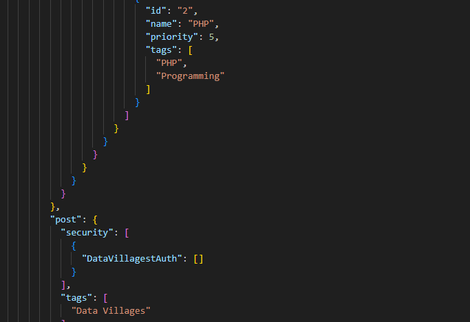
  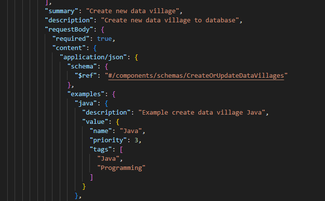
  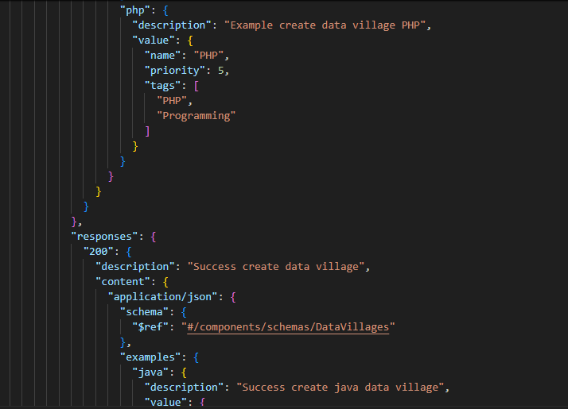
  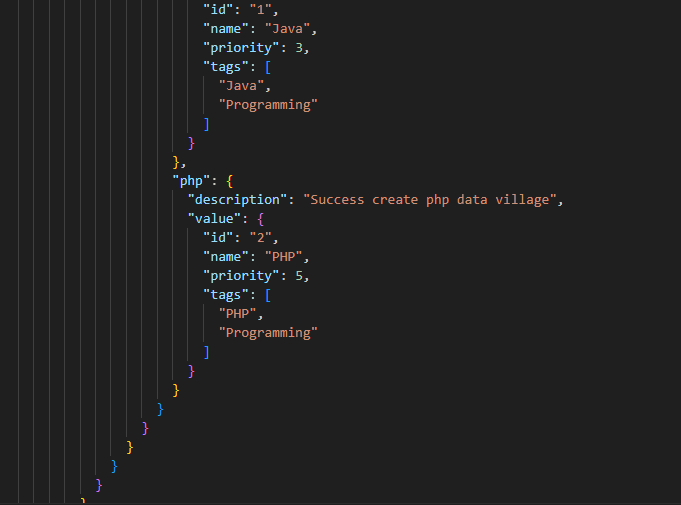
  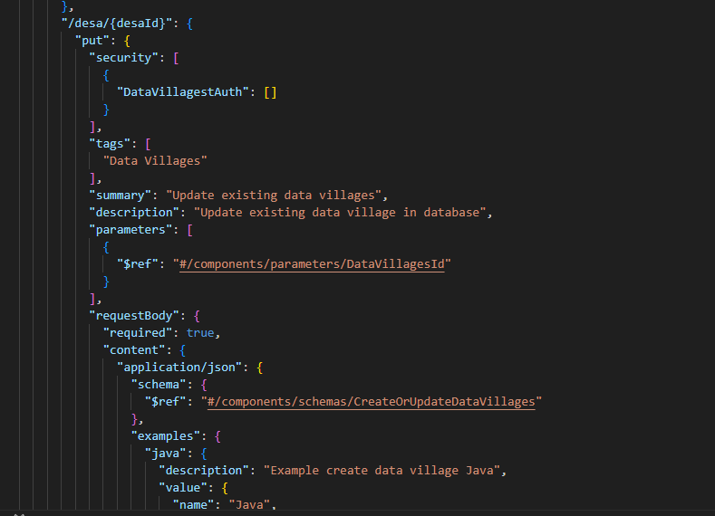
  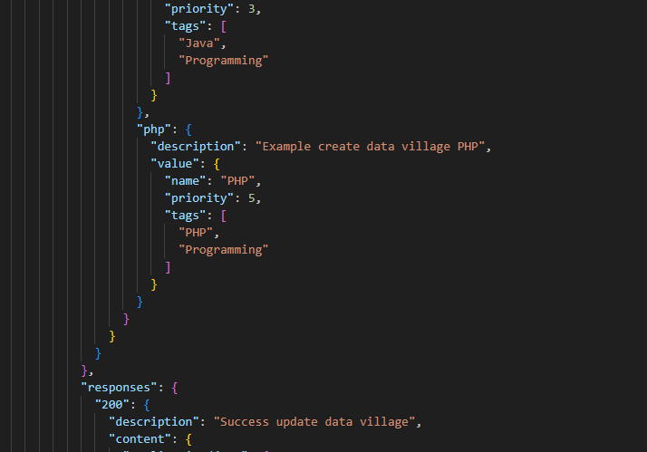
  
  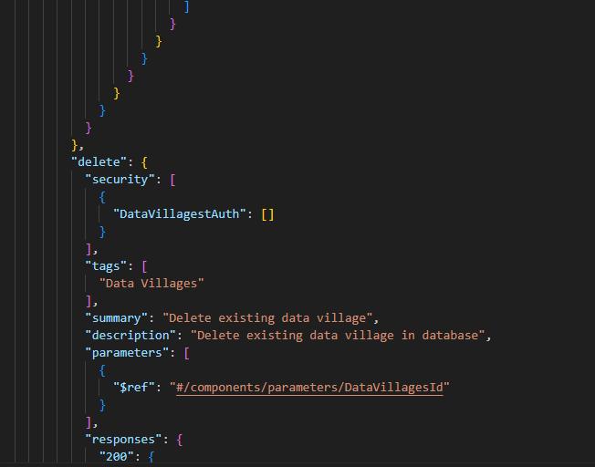
  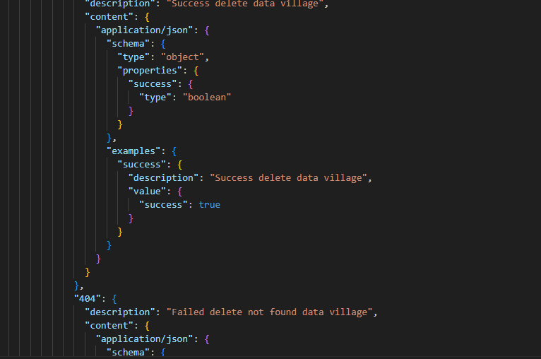
  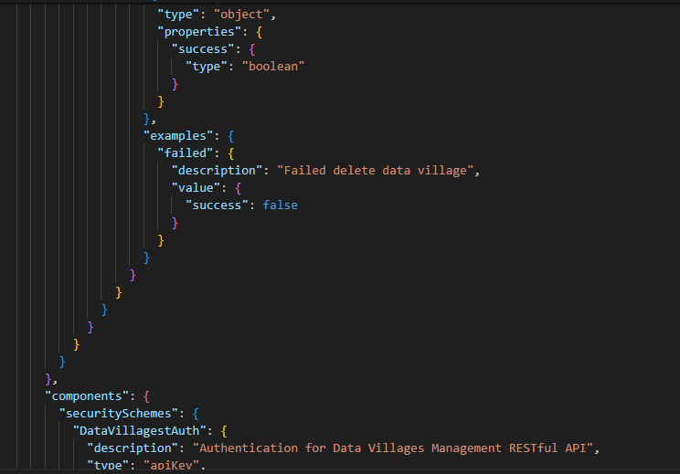
  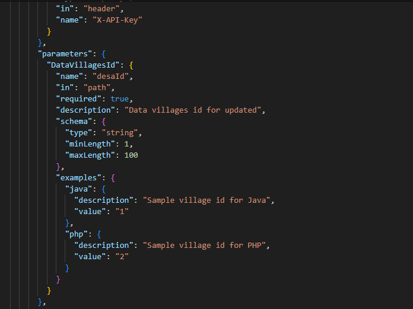
  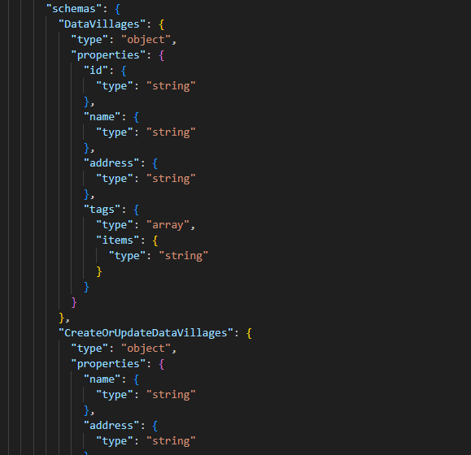
  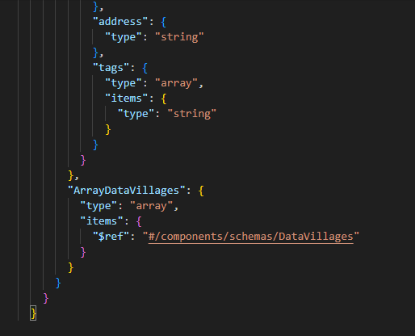
  
  <Strong><Li>Penjelasan Source Code</Li></Strong>
</ol>
  
 "openapi": "3.0.3": berfungsi untuk mendefinisikan versi OpenAPI yang digunakan dalam spesifikasi ini. "info": berfungsi untuk memberikan informasi metadata tentang API. Bagian yang termasuk dalam metadata API adalah judul, versi, deskripsi, alamat situs web untuk syarat dan ketentuan penggunaan, informasi kontak, dan lisensi. "title" untuk mendefinisikan Judul API. "version"untuk mendefinisikan Versi API. "description" untuk memberikan deskripsi singkat tentang API. "termsOfService": untuk mendefinisikan URL yang mengarah ke syarat dan ketentuan penggunaan API. "contact": untuk memberikan informasi kontak tim pengembang API, termasuk nama, alamat email, dan URL GitHub. "license": untuk memberikan informasi tentang lisensi API, termasuk nama dan URL lisensi.

"servers": untuk menentukan server atau lingkungan dimana API dapat diakses.
 "description": description pada server ini berfungsi untuk mendeskripsikan server.
"url": URL dasar API. {environment} adalah variabel yang harus diganti dengan nilai dari lingkungan (misalnya: development, production, staging).
"variables": Variabel yang dapat digunakan dalam URL. Dalam kasus ini, hanya ada satu variabel yaitu "environment" yang dapat memiliki nilai dari "development", "production", atau "staging".

 "externalDocs": berfungsi untuk memberikan tautan eksternal untuk dokumentasi tambahan. "description": adalah deskripsi singkat dari dokumen eksternal, yang merupakan GitHub repositori untuk Kelompok 11. "url": berfungsi untuk mendefinisikan URL ke dokumen eksternal tersebut, yaitu repositori GitHub kelompok 11. "paths": merupakan bagian yang menentukan jalur atau endpoint dari API. "/desa": digunakan untuk mengakses data desa atau data yang dimiliki oleh developer. "get": adalah metode HTTP yang digunakan, dalam hal ini GET berarti akses untuk mendapatkan data. "security": berfungsi untuk menentukan skema keamanan yang diterapkan untuk endpoint ini. Dalam hal ini, menggunakan skema keamanan bernama DataVillagestAuth. "tags": untuk menandai endpoint ini dengan tag yang diberikan, dimana tag tersebut adalah "Data Villages". "summary": berfungsi untuk mendefinisikan ringkasan singkat tentang apa yang dilakukan endpoint ini, yaitu "Get all Data Villages". "description": merupakan deskripsi lebih lanjut tentang apa yang dilakukan oleh endpoint ini, yaitu "Get all data villages by default". 

"parameters": diugunakan untuk daftar parameter yang diperlukan atau opsional untuk endpoint ini. "name": merupakan Nama parameter. "in": merupakan lokasi parameter, dalam hal ini adalah "query", yang berarti parameter disertakan dalam query string URL. "required": menunjukkan apakah parameter wajib atau tidak. Dalam hal ini, opsional karena diatur sebagai false. "description": merupakan deskripsi parameter, yaitu "Include deleted data desa in the result". "schema": yaitu skema data untuk parameter. "type": tipe data parameter, dalam hal ini adalah boolean. "nullable": menunjukkan apakah parameter dapat bernilai null. "default": Nilai default untuk parameter, dalam hal ini adalah false.

 "name": "name": Mennunjukkan bahwa parameter yang didefinisikan memiliki nama "name". Nama tersebut adalah yang akan digunakan untuk merujuk ke parameter ini dalam permintaan API. "in": "query": menunjukkan bahwa parameter ini akan disertakan sebagai bagian dari URL query string saat permintaan API dibuat. "required": false: menunjukkan bahwa parameter ini tidak diharuskan untuk disertakan dalam permintaan API dan apabila tidak disertakan, API akan tetap berfungsi dengan baik. "description": "Filter data villages by name": adalah deskripsi singkat tentang apa yang dilakukan oleh parameter ini. Dalam hal ini, parameter "name" digunakan untuk memfilter data desa berdasarkan nama. "schema": adalah bagian yang mendefinisikan tipe dan batasan lainnya untuk nilai parameter. "type": "string": menunjukkan bahwa nilai parameter harus berupa string. "nullable": true: menunjukkan bahwa nilai parameter dapat berupa null. "minLength": 1: menunjukkan bahwa panjang minimum string yang diperbolehkan adalah 1 karakter. "maxLength": 100: menunjukkan bahwa panjang maksimum string yang diperbolehkan adalah 100 karakter. "examples": adalah contoh-contoh nilai yang dapat digunakan untuk parameter ini, masing-masing diberi label sesuai dengan bahasa pemrograman. "java": adalah contoh yang diberi label "java". "description": "Example name Java": deskripsi dari contoh ini. "value": "Java": Nilai contoh, yaitu "Java". "php": adalah contoh yang diberi label "php". "description": "Example name PHP": merupakan deskripsi dari contoh ini. "value": "PHP": nilai contoh, yaitu "PHP". 

 "responses": adalah objek yang mendefinisikan respons yang akan dikirimkan oleh server setelah permintaan berhasil dilakukan. Respons didefinisikan dalam bentuk kode status HTTP. "200": adalah kode status HTTP yang menunjukkan bahwa permintaan telah berhasil diproses. "description": "Success get all data villages": adalah deskripsi singkat untuk menjelaskan bahwa permintaan berhasil dan data desa telah diperoleh dengan sukses. "content": adalah objek yang mendefinisikan tipe konten respons. "application/json": menunjukkan bahwa tipe konten respons adalah JSON. "schema": adalah bagian yang mendefinisikan struktur atau skema dari data yang akan dikirimkan dalam respons. "$ref": "#/components/schemas/ArrayDataVillages": adalah referensi ke skema yang sudah didefinisikan sebelumnya dalam komponen skema API. Skema ini disebut "ArrayDataVillages". "examples": adalah contoh-contoh dari data yang akan dikirimkan dalam respons. "success":  adalah contoh yang diberi label "success". "description": "Example success get all data village": adalah deskripsi dari contoh ini. "value": [...]: adalah nilai contoh, yang merupakan sebuah array dari data desa. Setiap elemen array mewakili sebuah desa dengan atribut-atribut seperti "id", "name", "priority", dan "tags". "id": "1": merupakan ID desa. "name": "Java": merupakan nama desa. "priority": 3: merupakan prioritas desa. "tags": ["Java", "Programming"]: Array yang berisi tag-tag yang terkait dengan desa tersebut.

  
  
