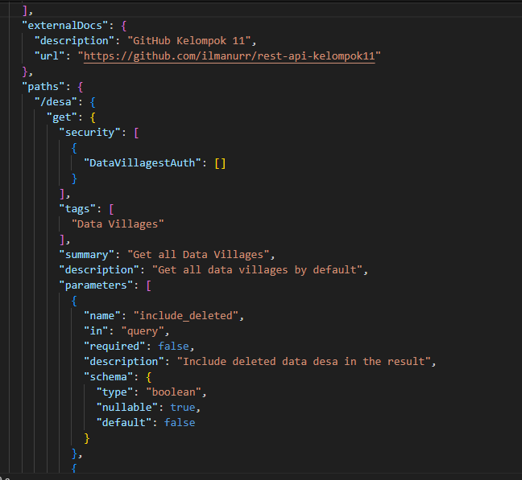

<h1>Kelompok 11 MI2022B</h1>
<h2> Tugas 2 API</h2>
<h2>Dokumentasi Open API</h2>

Anggota Kelompok:

Ilma Nur Hidayah (22091397064)

Haniza Kurnia Dwi Putri (22091397070)

Yohana Monalisa (2205102087)

 
<ol type = "a">
  <Strong><Li>Source Code</Li></Strong>
  
  
  
  
  
  
  
  
  
  
  
  
  
  
  
  
  
  
  <Strong><Li>Penjelasan Source Code</Li></Strong>
</ol>

"openapi": "3.0.3": berfungsi untuk mendefinisikan versi OpenAPI yang digunakan dalam spesifikasi ini. "info": berfungsi untuk memberikan informasi metadata tentang API. Bagian yang termasuk dalam metadata API adalah judul, versi, deskripsi, alamat situs web untuk syarat dan ketentuan penggunaan, informasi kontak, dan lisensi. "title" untuk mendefinisikan Judul API. "version"untuk mendefinisikan Versi API. "description" untuk memberikan deskripsi singkat tentang API. "termsOfService": untuk mendefinisikan URL yang mengarah ke syarat dan ketentuan penggunaan API. "contact": untuk memberikan informasi kontak tim pengembang API, termasuk nama, alamat email, dan URL GitHub. "license": untuk memberikan informasi tentang lisensi API, termasuk nama dan URL lisensi.
 "servers": untuk menentukan server atau lingkungan dimana API dapat diakses. "description": description pada server ini berfungsi untuk mendeskripsikan server. "url": URL dasar API. {environment} adalah variabel yang harus diganti dengan nilai dari lingkungan (misalnya: development, production, staging). "variables": Variabel yang dapat digunakan dalam URL. Dalam kasus ini, hanya ada satu variabel yaitu "environment" yang dapat memiliki nilai dari "development", "production", atau "staging".

"externalDocs": berfungsi untuk memberikan tautan eksternal untuk dokumentasi tambahan. "description": adalah deskripsi singkat dari dokumen eksternal, yang merupakan GitHub repositori untuk Kelompok 11. "url": berfungsi untuk mendefinisikan URL ke dokumen eksternal tersebut, yaitu repositori GitHub kelompok 11. "paths": merupakan bagian yang menentukan jalur atau endpoint dari API. "/desa": digunakan untuk mengakses data desa atau data yang dimiliki oleh developer. "get": adalah metode HTTP yang digunakan, dalam hal ini GET berarti akses untuk mendapatkan data. "security": berfungsi untuk menentukan skema keamanan yang diterapkan untuk endpoint ini. Dalam hal ini, menggunakan skema keamanan bernama DataVillagestAuth. "tags": untuk menandai endpoint ini dengan tag yang diberikan, dimana tag tersebut adalah "Data Villages". "summary": berfungsi untuk mendefinisikan ringkasan singkat tentang apa yang dilakukan endpoint ini, yaitu "Get all Data Villages". "description": merupakan deskripsi lebih lanjut tentang apa yang dilakukan oleh endpoint ini, yaitu "Get all data villages by default". 
 "parameters": diugunakan untuk daftar parameter yang diperlukan atau opsional untuk endpoint ini. "name": merupakan Nama parameter. "in": merupakan lokasi parameter, dalam hal ini adalah "query", yang berarti parameter disertakan dalam query string URL. "required": menunjukkan apakah parameter wajib atau tidak. Dalam hal ini, opsional karena diatur sebagai false. "description": merupakan deskripsi parameter, yaitu "Include deleted data desa in the result". "schema": yaitu skema data untuk parameter. "type": tipe data parameter, dalam hal ini adalah boolean. "nullable": menunjukkan apakah parameter dapat bernilai null. "default": Nilai default untuk parameter, dalam hal ini adalah false.

"name": "name": Mennunjukkan bahwa parameter yang didefinisikan memiliki nama "name". Nama tersebut adalah yang akan digunakan untuk merujuk ke parameter ini dalam permintaan API. "in": "query": menunjukkan bahwa parameter ini akan disertakan sebagai bagian dari URL query string saat permintaan API dibuat. "required": false: menunjukkan bahwa parameter ini tidak diharuskan untuk disertakan dalam permintaan API dan apabila tidak disertakan, API akan tetap berfungsi dengan baik. "description": "Filter data villages by name": adalah deskripsi singkat tentang apa yang dilakukan oleh parameter ini. Dalam hal ini, parameter "name" digunakan untuk memfilter data desa berdasarkan nama. "schema": adalah bagian yang mendefinisikan tipe dan batasan lainnya untuk nilai parameter. "type": "string": menunjukkan bahwa nilai parameter harus berupa string. "nullable": true: menunjukkan bahwa nilai parameter dapat berupa null. "minLength": 1: menunjukkan bahwa panjang minimum string yang diperbolehkan adalah 1 karakter. "maxLength": 100: menunjukkan bahwa panjang maksimum string yang diperbolehkan adalah 100 karakter. "examples": adalah contoh-contoh nilai yang dapat digunakan untuk parameter ini, masing-masing diberi label sesuai dengan bahasa pemrograman. "java": adalah contoh yang diberi label "java". "description": "Example name Java": deskripsi dari contoh ini. "value": "Java": Nilai contoh, yaitu "Java". "php": adalah contoh yang diberi label "php". "description": "Example name PHP": merupakan deskripsi dari contoh ini. "value": "PHP": nilai contoh, yaitu "PHP". 

"responses": adalah objek yang mendefinisikan respons yang akan dikirimkan oleh server setelah permintaan berhasil dilakukan. Respons didefinisikan dalam bentuk kode status HTTP. "200": adalah kode status HTTP yang menunjukkan bahwa permintaan telah berhasil diproses. "description": "Success get all data villages": adalah deskripsi singkat untuk menjelaskan bahwa permintaan berhasil dan data desa telah diperoleh dengan sukses. "content": adalah objek yang mendefinisikan tipe konten respons. "application/json": menunjukkan bahwa tipe konten respons adalah JSON. "schema": adalah bagian yang mendefinisikan struktur atau skema dari data yang akan dikirimkan dalam respons. "$ref": "#/components/schemas/ArrayDataVillages": adalah referensi ke skema yang sudah didefinisikan sebelumnya dalam komponen skema API. Skema ini disebut "ArrayDataVillages". "examples": adalah contoh-contoh dari data yang akan dikirimkan dalam respons. "success":  adalah contoh yang diberi label "success". "description": "Example success get all data village": adalah deskripsi dari contoh ini. "value": [...]: adalah nilai contoh, yang merupakan sebuah array dari data desa. Setiap elemen array mewakili sebuah desa dengan atribut-atribut seperti "id", "name", "priority", dan "tags". "id": "1": merupakan ID desa. "name": "Java": merupakan nama desa. "priority": 3: merupakan prioritas desa. "tags": ["Java", "Programming"]: Array yang berisi tag-tag yang terkait dengan desa tersebut.

"id": "2": adalah untuk identifikasi unik untuk objek yang dikirim atau diperoleh melalui API. Dalam konteks ini, mungkin merujuk ke id desa atau objek lainnya yang dibuat dalam sistem. "name": "PHP": adalah nama desa atau objek lainnya yang diidentifikasi oleh ID tersebut. "priority": 5: adalah prioritas desa atau objek yang dapat memberikan informasi tentang kepentingan atau urutan prioritas dalam konteks tertentu. "tags": ["PHP", "Programming"]: adalah daftar tag yang terkait dengan objek tersebut. Dalam kasus ini, tag menunjukkan bahwa desa tersebut terkait dengan bahasa pemrograman PHP. "post": menunjukkan bahwa bagian ini dari spesifikasi API adalah untuk metode HTTP POST, yang digunakan untuk menambahkan atau membuat objek baru di sistem. "security": adalah bagian dari spesifikasi yang menunjukkan persyaratan keamanan yang harus dipenuhi untuk mengakses endpoint ini. {"DataVillagestAuth": []}: menunjukkan bahwa endpoint ini memerlukan autentikasi menggunakan skema autentikasi "DataVillagestAuth". Namun, dalam contoh ini, tidak ada informasi tambahan yang diberikan tentang bagaimana autentikasi ini harus dilakukan, karena array kosong menunjukkan bahwa tidak ada data tambahan yang diperlukan.

"summary": "Create new data village": adalah ringkasan singkat dari tujuan endpoint ini. Dalam hal ini, endpoint digunakan untuk membuat objek baru dalam database, yang dalam konteks ini adalah sebuah desa. "description": "Create new data village to database": adalah deskripsi yang lebih rinci tentang fungsi endpoint ini. Deskripsi ini menjelaskan bahwa tujuan dari endpoint ini adalah untuk membuat objek desa baru dan menyimpannya dalam database. "requestBody": adalah bagian yang mendefinisikan struktur data yang harus disertakan dalam permintaan (request) untuk endpoint ini. "required": true: menunjukkan bahwa badan permintaan (request body) harus disertakan dalam permintaan. Dalam konteks ini, badan permintaan diperlukan untuk membuat objek desa baru. "content": adalah jenis konten yang diharapkan dalam badan permintaan. "application/json": menunjukkan bahwa badan permintaan harus berupa JSON. "schema": adalah skema (struktur) dari data yang diharapkan dalam badan permintaan. "$ref": "#/components/schemas/CreateOrUpdateDataVillages": adalah referensi ke skema yang sudah didefinisikan sebelumnya dalam komponen skema API. Skema ini mungkin berisi definisi atribut-atribut yang diharapkan untuk objek desa baru. "examples": adalah contoh dari data yang diharapkan dalam badan permintaan, diberikan dalam beberapa bahasa pemrograman. "java": adalah contoh yang diberi label "java". "description": "Example create data village Java": merupakan deskripsi dari contoh ini. "value": { ... }: adalah nilai contoh, yaitu objek desa baru yang akan dibuat. Objek ini memiliki atribut-atribut seperti "name", "priority", dan "tags", yang merupakan data yang diharapkan dalam badan permintaan. "name": "Java": merupakan nama desa baru. "priority": 3: merupakan prioritas desa baru. "tags": ["Java", "Programming"]: merupakan array tag yang terkait dengan desa baru.

"php": adalah label yang menunjukkan contoh respons dalam bahasa pemrograman PHP. "description": "Example create data village PHP": adalah deskripsi singkat dari contoh respons ini, yang mana kode ini menjelaskan bahwa ini adalah contoh respons yang menunjukkan pembuatan objek desa dalam bahasa pemrograman PHP. "value": { ... }: adalah nilai contoh, yaitu objek desa yang telah dibuat. Hal ini mencakup atribut-atribut seperti "name", "priority", dan "tags", yang merupakan informasi tentang desa yang baru saja dibuat. "name": "PHP": merupakan nama desa yang baru saja dibuat. "priority": 5: merupakan prioritas desa yang baru saja dibuat. "tags": ["PHP", "Programming"]: merupakan array tag yang terkait dengan desa yang baru saja dibuat. "responses": adalah bagian yang mendefinisikan respons dari server setelah permintaan berhasil diproses. "200": adalah kode status HTTP yang menunjukkan bahwa permintaan telah berhasil diproses. "description": "Success create data village": merupakan deskripsi singkat dari respons yang juga menyatakan bahwa permintaan telah berhasil membuat desa baru. "content": adalah jenis konten yang akan dikirimkan dalam respons. "application/json": menunjukkan bahwa respons akan berupa data JSON. "schema": adalah skema (struktur) dari data yang akan dikirimkan dalam respons. "$ref": "#/components/schemas/DataVillages": adalah referensi ke skema yang sudah didefinisikan sebelumnya dalam komponen skema API. Skema ini mungkin berisi definisi atribut-atribut yang diharapkan untuk objek desa. "examples": adalah contoh dari data yang akan dikirimkan dalam respons. "java": adalah contoh yang diberi label "java". "description": "Success create java data village": merupakan deskripsi dari contoh ini. "value": { ... }: adalah nilai contoh, yang mungkin adalah objek desa yang baru saja dibuat dalam bahasa pemrograman Java.

"id": "1" dan "id": "2": adalah identifikasi unik untuk setiap objek desa. Setiap desa memiliki ID yang berbeda, yang dapat digunakan untuk mengidentifikasi dan mengakses desa secara unik. "name": "Java" dan "name": "PHP": adalah nama dari masing-masing desa. Setiap desa memiliki nama yang berbeda, yaitu "Java" dan "PHP" dalam contoh ini. "priority": 3 dan "priority": 5: adalah prioritas dari masing-masing desa. Prioritas digunakan untuk memberikan tingkat penting atau urutan yang lebih tinggi pada desa tertentu. Desa dengan prioritas lebih tinggi mungkin diperlakukan secara berbeda dalam sistem. "tags": ["Java", "Programming"] dan "tags": ["PHP", "Programming"]: adalah daftar tag yang terkait dengan masing-masing desa. Tag-tag ini memberikan informasi tambahan tentang desa, seperti bahasa pemrograman yang terkait (misalnya "Java" atau "PHP"). Dalam contoh ini, kedua desa memiliki tag "Programming" yang menunjukkan bahwa mereka terkait dengan pemrograman, dan masing-masing desa juga memiliki tag yang sesuai dengan nama bahasa pemrograman yang digunakan.

"/desa/{desaId}": adalah path dari endpoint API. {desaId} adalah parameter jalur yang akan digantikan dengan ID desa yang ingin diubah saat permintaan dilakukan. Misalnya, jika kita ingin mengubah desa dengan ID 1, kita akan menggunakan path /desa/1. "put": adalah kode yang menunjukkan bahwa metode HTTP yang digunakan untuk endpoint ini adalah PUT. Metode PUT digunakan untuk mengirimkan data untuk dimasukkan atau diperbarui pada server, dalam hal ini untuk memperbarui data desa yang sudah ada. "security": adalah bagian yang menunjukkan persyaratan keamanan yang harus dipenuhi untuk mengakses endpoint ini. Dalam kasus ini, persyaratan keamanannya adalah autentikasi menggunakan skema autentikasi "DataVillagestAuth". "tags": adalah label atau kategori yang diberikan kepada endpoint ini. Dalam hal ini, endpoint ini termasuk dalam kategori "Data Villages". "summary": adalah ringkasan singkat dari tujuan endpoint ini. Endpoint ini digunakan untuk memperbarui data desa yang sudah ada. "description": Ini adalah deskripsi yang lebih rinci tentang fungsi endpoint ini. Deskripsi ini menjelaskan bahwa tujuan dari endpoint ini adalah untuk memperbarui data desa yang sudah ada dalam database. "parameters": adalah parameter yang diperlukan untuk endpoint ini. "$ref": "#/components/parameters/DataVillagesId": adalah referensi ke parameter yang sudah didefinisikan sebelumnya dalam komponen parameter API. Parameter ini mungkin berisi informasi tentang ID desa yang akan diubah. "requestBody": adalah bagian yang mendefinisikan struktur data yang harus disertakan dalam badan permintaan (request body) untuk endpoint ini. "required": true: menunjukkan bahwa badan permintaan (request body) harus disertakan dalam permintaan. Dalam konteks ini, badan permintaan diperlukan untuk memperbarui data desa. "content": adalah jenis konten yang diharapkan dalam badan permintaan. "application/json": menunjukkan bahwa badan permintaan harus berupa JSON. "schema": adalah skema (struktur) dari data yang diharapkan dalam badan permintaan. "$ref": "#/components/schemas/CreateOrUpdateDataVillages": adalah referensi ke skema yang sudah didefinisikan sebelumnya dalam komponen skema API. Skema ini mungkin berisi definisi atribut-atribut yang diharapkan untuk objek desa yang akan diperbarui. "examples": adalah contoh dari data yang diharapkan dalam badan permintaan, diberikan dalam beberapa bahasa pemrograman. Dalam contoh ini, hanya contoh dalam bahasa pemrograman Java yang diberikan. "java": adalah contoh yang diberi label "java". "description": "Example create data village Java": merupakan deskripsi dari contoh ini. "value": { ... }: adalah nilai contoh, yaitu objek desa yang akan diperbarui dengan data baru. Objek ini memiliki atribut-atribut seperti "name", "priority", dan "tags", yang merupakan data yang diharapkan dalam badan permintaan.

"priority": 3: adalah atribut yang menunjukkan prioritas dari suatu entitas dalam konteks spesifikasi API ini. Dalam contoh ini, entitas yang diberi prioritas adalah yang terkait dengan Java, dan prioritasnya adalah 3. "tags": ["Java", "Programming"]: adalah atribut yang berisi daftar tag yang terkait dengan entitas yang didefinisikan. Dalam kasus ini, tag-tag ini menunjukkan bahwa entitas tersebut terkait dengan bahasa pemrograman Java dan pemrograman secara umum. "description": "Example create data village PHP": adalah deskripsi yang memberikan informasi tambahan tentang entitas yang terkait dengan PHP. Deskripsi ini menjelaskan contoh pembuatan data desa menggunakan PHP. "value": { "name": "PHP", "priority": 5, "tags": ["PHP", "Programming"] }: adalah nilai yang terkait dengan entitas PHP. Ini termasuk nama entitas, yang dalam kasus ini adalah PHP, prioritasnya adalah 5, dan tag-tag yang menunjukkan bahwa entitas tersebut terkait dengan PHP dan pemrograman secara umum.

"application/json": menunjukkan bahwa jenis konten yang diharapkan dalam respons adalah JSON. Hal ini berarti bahwa server diharapkan untuk mengirimkan data dalam format JSON kepada klien yang melakukan permintaan. "schema": adalah bagian yang mendefinisikan skema (struktur) dari data yang diharapkan dalam respons. "$ref": "#/components/schemas/DataVillages": adalah referensi ke skema yang sudah didefinisikan sebelumnya dalam komponen skema API. Skema ini mungkin berisi definisi atribut-atribut yang diharapkan untuk objek desa. "examples": adalah contoh-contoh dari data yang diharapkan dalam respons, diberikan dalam beberapa bahasa pemrograman. "java": adalah contoh respons yang diberi label "java". "description": "Success create java data village": merupakan deskripsi dari contoh respons ini. Ini menyatakan bahwa respons ini adalah contoh dari berhasilnya pembuatan desa baru dalam bahasa pemrograman Java. "value": { ... }: adalah nilai contoh, yaitu objek desa yang baru saja dibuat dalam bahasa pemrograman Java. Objek ini memiliki atribut-atribut seperti "id", "name", "priority", dan "tags", yang merupakan informasi tentang desa yang baru saja dibuat. "php": adalah contoh respons yang diberi label "php". "description": "Success create php data village": merupakan deskripsi dari contoh respons ini yang menyatakan bahwa respons ini adalah contoh dari berhasilnya pembuatan desa baru dalam bahasa pemrograman PHP. "value": { ... }: adalah nilai contoh, yaitu objek desa yang baru saja dibuat dalam bahasa pemrograman PHP. Objek ini memiliki atribut-atribut yang sama dengan objek contoh dalam bahasa pemrograman Java, yaitu "id", "name", "priority", dan "tags".

"delete": adalah operasi HTTP yang ditentukan dalam API ini, menunjukkan bahwa operasi yang dijelaskan dalam blok ini adalah operasi DELETE. "security": adalah bagian yang menentukan keamanan yang diperlukan untuk mengakses operasi DELETE ini. Dalam hal ini, itu berisi konfigurasi keamanan di mana hanya pengguna yang telah diotorisasi melalui "DataVillagestAuth" yang dapat mengakses operasi ini. Namun, dalam contoh ini, tidak ada konfigurasi spesifik yang diberikan, mungkin karena hanya menunjukkan bahwa operasi ini memerlukan otentikasi tanpa detail spesifik lebih lanjut. "tags": menandakan kategori atau label untuk operasi ini. Dalam kasus ini, operasi tersebut terkait dengan "Data Villages". "summary": memberikan ringkasan singkat tentang apa yang dilakukan oleh operasi DELETE ini, yaitu menghapus data desa yang ada. "description": memberikan deskripsi lebih rinci tentang apa yang dilakukan oleh operasi DELETE ini, yaitu menghapus data desa yang ada dari database. "parameters": adalah daftar parameter yang diperlukan untuk operasi DELETE ini. Dalam contoh ini, hanya ada satu parameter yang diperlukan, yang disebut "DataVillagesId". Ini kemungkinan adalah referensi ke parameter yang didefinisikan di tempat lain dalam spesifikasi API. "responses": adalah tanggapan yang diharapkan dari server setelah operasi DELETE telah dilakukan. Dalam kasus ini, hanya ada satu tanggapan yang didefinisikan, yaitu kode status HTTP 200 yang menunjukkan bahwa operasi telah berhasil dieksekusi. Namun, potongan kode JSON ini tidak lengkap, karena kurangnya definisi objek tanggapan. Mungkin ada bagian lebih lanjut dari objek tanggapan yang tidak disertakan dalam kutipan yang diberikan.

"description": "Success delete data village": adalah deskripsi singkat dari respons ini. Deskripsi ini menjelaskan bahwa operasi penghapusan data desa berhasil dilakukan. "content": adalah bagian yang mendefinisikan jenis konten yang akan dikirimkan dalam respons. "application/json": menunjukkan bahwa jenis konten respons adalah JSON. "schema": adalah skema (struktur) dari data yang akan dikirimkan dalam respons. "type": "object": menunjukkan bahwa data yang akan dikirimkan dalam respons adalah sebuah objek. "properties": adalah properti-properti yang dimiliki oleh objek. "success": adalah properti yang menunjukkan apakah operasi penghapusan berhasil atau tidak. "type": "boolean": menunjukkan bahwa nilai properti "success" adalah tipe boolean, yang dapat bernilai true (berhasil) atau false (gagal).
"examples": adalah contoh dari data yang akan dikirimkan dalam respons. "success": adalah contoh yang diberi label "success". "description": "Success delete data village": merupakan deskripsi dari contoh ini. Ini menjelaskan bahwa contoh ini adalah contoh dari berhasilnya operasi penghapusan data desa. "value": { "success": true }: adalah nilai contoh, yang menunjukkan bahwa operasi penghapusan data desa berhasil ("success" bernilai true). "404": adalah kode status HTTP yang menunjukkan bahwa data yang diminta tidak ditemukan. "description": "Failed delete not found data village": adalah deskripsi singkat dari respons ini. Deskripsi ini menjelaskan bahwa operasi penghapusan data desa gagal karena data desa yang diminta tidak ditemukan. "content": adalah bagian yang mendefinisikan jenis konten yang akan dikirimkan dalam respons. "application/json": menunjukkan bahwa jenis konten respons adalah JSON. "schema": adalah skema (struktur) dari data yang akan dikirimkan dalam respons. (Tidak disertakan dalam kutipan yang diberikan, tetapi kemungkinan akan dilanjutkan dalam kode JSON selanjutnya.)

"type": "object": mendefinisikan bahwa entitas yang dijelaskan dalam blok ini adalah objek. "properties": { "success": { "type": "boolean" } }: mendefinisikan bahwa objek tersebut memiliki properti bernama "success" yang bertipe boolean. Properti ini mungkin digunakan untuk menandai apakah operasi yang diminta berhasil atau gagal. "examples": { "failed": { ... } }: adalah contoh penggunaan dari objek yang didefinisikan sebelumnya. Dalam contoh ini, ada contoh yang diberikan untuk situasi di mana sebuah operasi gagal. Deskripsi "Failed delete data village" memberikan informasi tentang apa yang terjadi ketika operasi gagal. Objek yang diberikan sebagai nilai properti adalah { "success": false }, yang menunjukkan bahwa operasi gagal. "components": { "securitySchemes": { ... } }: Bagian ini mendefinisikan skema keamanan yang digunakan dalam API. Dalam contoh ini, skema keamanan disebut "DataVillagestAuth" dan dijelaskan sebagai metode otentikasi untuk API manajemen desa data. Tipe "apiKey" menunjukkan bahwa API menggunakan kunci API untuk otentikasi.

"in": "header": menunjukkan bahwa parameter ini diharapkan akan ditempatkan dalam bagian header permintaan HTTP.
"name": "X-API-Key": Nama yang akan digunakan untuk parameter ini dalam header permintaan HTTP. "parameters": bagian ini berisi definisi parameter-parameter yang dibutuhkan oleh API. "DataVillagesId": adalah nama parameter yang didefinisikan. "name": "desaId": merupakan nama yang akan digunakan untuk parameter ini dalam permintaan API. "in": "path": menunjukkan bahwa parameter ini diharapkan akan ditempatkan dalam bagian path (URI) permintaan HTTP. "required": true: menandakan bahwa parameter ini wajib ada dalam permintaan. "description": "Data villages id for updated": merupakan deskripsi singkat tentang tujuan atau penggunaan parameter. "schema": berisi informasi tentang jenis dan sifat nilai yang diterima oleh parameter ini. "type": "string": jenis nilai yang diharapkan adalah string. "minLength": 1: mendefinisikan bahwa panjang minimum string yang diperbolehkan adalah 1 karakter. "maxLength": 100: mendefinisikan bahwa panjang maksimum string yang diperbolehkan adalah 100 karakter. "examples": merupakan pendefinisian contoh-contoh nilai parameter untuk bahasa pemrograman tertentu. "java": merupakan contoh nilai untuk penggunaan dalam bahasa pemrograman Java. "description": "Sample village id for Java": Deskripsi singkat tentang contoh nilai untuk Java. "value": "1": merupakan nilai contoh untuk Java. "php": merupakan contoh nilai untuk penggunaan dalam bahasa pemrograman PHP. "description": "Sample village id for PHP": merupakan deskripsi singkat tentang contoh nilai untuk PHP. "value": "2": nilai contoh untuk PHP.

"schemas": adalah objek yang berisi definisi untuk skema JSON yang berbeda. Skema JSON adalah cara untuk mendefinisikan struktur data yang diharapkan dalam dokumen JSON. "DataVillages": adalah nama dari skema pertama yang didefinisikan di dalam objek "schemas". Skema ini tampaknya digunakan untuk merepresentasikan data desa. "type": "object": mengindikasikan bahwa struktur data yang diharapkan adalah sebuah objek JSON. "properties": adalah objek yang berisi definisi untuk properti-properti yang diharapkan dari objek JSON. "id": adalah properti yang diharapkan untuk menyimpan ID desa. "type": "string": mendefinisikan bahwa properti "id" harus berupa string. "name": adalah properti yang diharapkan untuk menyimpan nama desa. "type": "string": mengindikasikan bahwa properti "name" harus berupa string. "address": adalah properti yang diharapkan untuk menyimpan alamat desa. "type": "string": properti "address" harus berupa string. "tags": adalah properti yang diharapkan untuk menyimpan tag-tag yang terkait dengan desa. "type": "array": properti "tags" harus berupa array. "items": adalah objek yang berisi definisi untuk elemen-elemen dalam array "tags". "type": "string": elemen-elemen dalam array "tags" harus berupa string. "CreateOrUpdateDataVillages": adalah nama dari skema kedua yang didefinisikan di dalam objek "schemas". Skema ini tampaknya digunakan untuk membuat atau memperbarui data desa. "type": "object": mengindikasikan bahwa struktur data yang diharapkan adalah sebuah objek JSON. "properties": adalah objek yang berisi definisi untuk properti-properti yang diharapkan dari objek JSON. "name": adalah properti yang diharapkan untuk menyimpan nama desa. "type": "string": properti "name" harus berupa string. "address": adalah properti yang diharapkan untuk menyimpan alamat desa. (Pada contoh kode yang Anda berikan, definisi untuk properti ini tidak lengkap.)

"address": { "type": "string" }: mendefinisikan sebuah properti bernama "address" yang merupakan tipe data string. Ini menunjukkan bahwa nilai dari properti "address" harus berupa string. "tags": { "type": "array", "items": { "type": "string" } }: mendefinisikan sebuah properti bernama "tags". Properti ini memiliki tipe data array (kumpulan nilai). Setiap elemen di dalam array ini harus berupa string. Dengan kata lain, "tags" adalah kumpulan string yang terdiri dari beberapa tag. "ArrayDataVillages": { "type": "array", "items": { "$ref": "#/components/schemas/DataVillages" } }: mendefinisikan properti "ArrayDataVillages". Properti ini memiliki tipe data array, artinya nilainya berupa kumpulan data. Setiap elemen dalam array ini mengacu pada skema yang sudah didefinisikan sebelumnya dalam komponen "DataVillages". Ini menggunakan referensi "$ref" untuk merujuk ke skema yang sudah didefinisikan sebelumnya.

  
  
